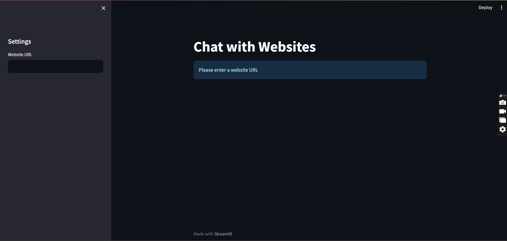

# Chat with a Website from URL (Langchain, LLM, OPEN AI)

This is a chatbot built using Python, leveraging the power of cutting-edge technologies such as OpenAI's Language Model (LLM) and LangCHAIN. The purpose of this chatbot is to provide users with information about any given website by simply inputting its URL.


## Screenshots




## Tech Stack

Following technologies are used in this project:

- LLMS
- OPEN AI
- LangChain
- StreamLit


## Installation

Ensure you have python installed.

Clone the  repository:

```bash
  git clone [repository-link]
  cd [repository-directory]
```

To install the required packages run the following command:

```bash
  pip install -r requirements.txt
```
Create your own .env file with the following variables:

```bash
OPENAI_API_KEY=[your-openai-api-key]
```
## Usage

To run the app use following command:

```bash
  python -m streamlit run src/app.py
```
## 
I hope this repository helps you in your journey of exploring AI and chatbot development. 
Don't forget to star this repo if you find it useful!

